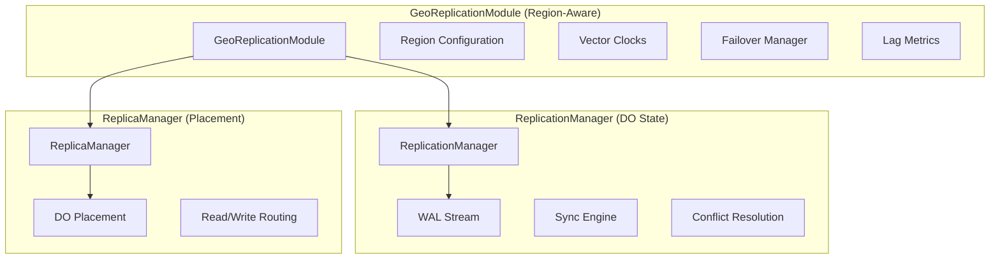

import { Callout } from 'fumadocs-ui/components/callout'

# Geo-Replication Architecture

dotdo provides a comprehensive geo-replication system for distributing data across Cloudflare's global edge network. This document covers the internal architecture, design decisions, and implementation details.

## Overview

The geo-replication system consists of three main components:

| Component | File | Purpose |
|-----------|------|---------|
| **GeoReplicationModule** | `objects/GeoReplication.ts` | High-level geo-replication for DOs with region awareness |
| **ReplicationManager** | `objects/persistence/replication-manager.ts` | Cross-DO state replication (primary/replica topology) |
| **ReplicaManager** | `db/core/replica.ts` | Geo-distribution and placement for the compat layer |



---

## Component Architecture

### 1. GeoReplicationModule

The `GeoReplicationModule` is a lifecycle module that attaches to DOs and provides region-aware replication capabilities.

**Key responsibilities:**
- Region configuration (primary + replicas)
- Write forwarding to primary region
- Read routing to nearest replica
- Conflict resolution (LWW, vector clocks, manual)
- Failover orchestration
- Replication lag monitoring

```typescript
// GeoReplicationModule attaches to DO lifecycle
class GeoReplicationModule implements LifecycleModule {
  initialize(context: LifecycleContext): void

  // Region Configuration
  configureRegion(config: RegionConfig): Promise<GeoConfigResult>
  getRegionConfig(): Promise<GeoConfigResult>
  listAvailableRegions(): Promise<RegionInfo[]>

  // Write Operations
  write(key: string, value: unknown): Promise<WriteResult>
  writeBatch(items: Array<{ key: string; value: unknown }>): Promise<WriteResult[]>
  writeWithTimestamp(key: string, value: unknown, timestamp: number): Promise<WriteResult>
  writeWithVectorClock(key: string, value: unknown, vectorClock: VectorClock): Promise<WriteResult>

  // Read Operations
  read<T>(key: string, options?: ReadOptions): Promise<ReadResult<T>>

  // Conflict Resolution
  getVectorClock(key: string): Promise<VectorClock>
  getConflicts(): Promise<ConflictInfo[]>
  resolveConflict(key: string, resolvedValue: unknown): Promise<void>

  // Failover
  triggerFailover(): Promise<FailoverEvent>
  getFailoverHistory(): Promise<FailoverEvent[]>

  // Metrics
  getReplicationLag(): Promise<ReplicationLagMetrics>
  getMetricsPrometheus(): Promise<string>
}
```

### 2. ReplicationManager

The `ReplicationManager` handles cross-DO state synchronization using WAL (Write-Ahead Log) streaming.

**Key responsibilities:**
- Primary/replica topology management
- Synchronous, asynchronous, and lazy replication modes
- WAL-based state synchronization
- Conflict detection and resolution
- Promotion/demotion operations

```typescript
class ReplicationManager {
  // Topology
  setPrimary(): Promise<void>
  setReplica(primaryNs: string): Promise<void>
  registerReplica(replicaNs: string): Promise<void>

  // Sync Operations
  sync(): Promise<ReplicationSyncResult>
  fullSync(): Promise<ReplicationSyncResult>
  incrementalSync(): Promise<ReplicationSyncResult>

  // Data Operations
  write(key: string, data: unknown): Promise<{ acknowledged?: boolean; queued?: boolean }>
  read(key: string): Promise<unknown>

  // Failover
  promote(): Promise<void>
  demote(): Promise<void>

  // Conflict Resolution
  setConflictStrategy(strategy: ConflictResolutionStrategy): void
  resolveConflicts(): Promise<ReplicationConflict[]>
}
```

### 3. ReplicaManager

The `ReplicaManager` handles DO placement and routing based on jurisdiction, region, and city constraints.

**Key responsibilities:**
- Jurisdiction enforcement (EU, US, FedRAMP)
- Region-based placement hints
- City-level (IATA code) precise placement
- Read routing (nearest, primary, secondary)
- Write-through replication

```typescript
class ReplicaManager {
  // Stub Acquisition
  getPrimaryStub(name: string): Promise<DurableObjectStub>
  getStubInCity(name: string, city: City): Promise<DurableObjectStub>
  getStubInRegion(name: string, region: Region): Promise<DurableObjectStub>
  getReadStub(name: string): Promise<DurableObjectStub>
  getWriteStub(name: string): Promise<DurableObjectStub>

  // Write Operations
  writeThroughAll<T>(name: string, path: string, init?: RequestInit): Promise<WriteResult<T>[]>
}
```

---

## Region Configuration

### Placement Hierarchy

dotdo supports three levels of placement precision, each with different guarantees:

```
┌─────────────────────────────────────────────────────────────┐
│                     JURISDICTION (Guaranteed)                │
│                 Cloudflare enforces data sovereignty         │
│                    eu | us | fedramp                         │
└─────────────────────────────────────────────────────────────┘
                              │
                              ▼
┌─────────────────────────────────────────────────────────────┐
│                    REGION (Location Hint)                    │
│            AWS-style names mapped to CF hints                │
│     us-east-1 → enam, eu-west-1 → weur, etc.                │
└─────────────────────────────────────────────────────────────┘
                              │
                              ▼
┌─────────────────────────────────────────────────────────────┐
│                     CITY (IATA Codes)                        │
│              Guaranteed colo placement via colo.do           │
│           iad, lax, fra, lhr, sin, nrt, syd, etc.           │
└─────────────────────────────────────────────────────────────┘
```

### Region Proximity Map

The system maintains a proximity map for routing reads to the nearest replica:

```typescript
// From GeoReplication.ts
const REGION_PROXIMITY: Map<string, string[]> = new Map([
  ['us-east', ['ewr', 'iad', 'atl', 'ord', 'dfw', 'lax', 'sea', 'sfo']],
  ['us-west', ['lax', 'sfo', 'sea', 'dfw', 'ord', 'atl', 'ewr', 'iad']],
  ['eu-west', ['lhr', 'dub', 'ams', 'cdg', 'fra', 'mad', 'mxp', 'vie', 'zrh']],
  ['eu-central', ['fra', 'ams', 'vie', 'zrh', 'mxp', 'cdg', 'lhr', 'dub', 'mad']],
  ['ap-south', ['sin', 'bom', 'hkg', 'nrt', 'syd']],
  ['ap-northeast', ['nrt', 'hkg', 'sin', 'syd', 'bom']],
  // ... IATA code to IATA code mappings
])
```

---

## Write Flow

### Write Forwarding to Primary

All writes are forwarded to the primary region, then propagated to replicas:

```
┌─────────────────────────────────────────────────────────────┐
│                     Client Write Request                     │
└─────────────────────────────────────────────────────────────┘
                              │
                              ▼
┌─────────────────────────────────────────────────────────────┐
│                  1. Check Primary Availability               │
│                                                              │
│   if (failedRegions.has(config.primary)) {                  │
│     throw new Error('Primary region unavailable')           │
│   }                                                          │
└─────────────────────────────────────────────────────────────┘
                              │
                              ▼
┌─────────────────────────────────────────────────────────────┐
│                   2. Store Data in Primary                   │
│                                                              │
│   await storage.put(`geo:data:${key}`, {                    │
│     value, timestamp, region: primary, version              │
│   })                                                         │
└─────────────────────────────────────────────────────────────┘
                              │
                              ▼
┌─────────────────────────────────────────────────────────────┐
│                  3. Update Vector Clock                      │
│                                                              │
│   vectorClock[primary] = (vectorClock[primary] ?? 0) + 1    │
└─────────────────────────────────────────────────────────────┘
                              │
                              ▼
┌─────────────────────────────────────────────────────────────┐
│                  4. Propagate to Replicas                    │
│                                                              │
│   for (replica of replicas) {                               │
│     if (partitioned) queue for later                        │
│     else propagate immediately                               │
│   }                                                          │
└─────────────────────────────────────────────────────────────┘
                              │
                              ▼
┌─────────────────────────────────────────────────────────────┐
│                  5. Return WriteResult                       │
│                                                              │
│   { key, primaryRegion, propagatedTo, timestamp }           │
└─────────────────────────────────────────────────────────────┘
```

### Write Queuing During Partition

When a network partition is detected, writes are queued for later delivery:

```typescript
// Writes queue during partition
if (partitionedRegions.has(replica)) {
  const queue = await storage.get(`geo:queue:${replica}`) ?? []
  queue.push({ key, value, timestamp })
  await storage.put(`geo:queue:${replica}`, queue)
}
```

---

## Read Flow

### Read Routing Algorithm

Reads are routed based on the configured read preference and caller location:

```
┌─────────────────────────────────────────────────────────────┐
│                     Client Read Request                      │
│                    callerRegion: 'eu-central'               │
└─────────────────────────────────────────────────────────────┘
                              │
                              ▼
┌─────────────────────────────────────────────────────────────┐
│               1. Determine Read Preference                   │
│                                                              │
│   switch (config.readPreference) {                          │
│     case 'nearest': findNearestRegion(callerRegion)         │
│     case 'primary': return config.primary                   │
│     case 'secondary': return config.replicas[0]             │
│   }                                                          │
└─────────────────────────────────────────────────────────────┘
                              │
                              ▼
┌─────────────────────────────────────────────────────────────┐
│               2. Check Staleness Bounds                      │
│                                                              │
│   if (consistency === 'bounded-staleness') {                │
│     if (lag > maxStalenessMs) sourceRegion = primary        │
│   }                                                          │
└─────────────────────────────────────────────────────────────┘
                              │
                              ▼
┌─────────────────────────────────────────────────────────────┐
│               3. Check Region Availability                   │
│                                                              │
│   if (failedRegions.has(sourceRegion)) {                    │
│     sourceRegion = primary  // Fallback                     │
│   }                                                          │
└─────────────────────────────────────────────────────────────┘
                              │
                              ▼
┌─────────────────────────────────────────────────────────────┐
│               4. Cache Routing Decision                      │
│                                                              │
│   routingCache.set(callerRegion, {                          │
│     region: sourceRegion, cachedAt: Date.now()              │
│   })                                                         │
└─────────────────────────────────────────────────────────────┘
                              │
                              ▼
┌─────────────────────────────────────────────────────────────┐
│               5. Return ReadResult                           │
│                                                              │
│   { value, sourceRegion, version, timestamp }               │
└─────────────────────────────────────────────────────────────┘
```

### Nearest Region Selection

The `findNearestRegion` function uses the proximity map with caching:

```typescript
private findNearestRegion(callerRegion: string, config: GeoConfigResult): string {
  // 1. Check routing cache (60-second TTL)
  const cached = this.routingCache.get(callerRegion)
  if (cached && Date.now() - cached.cachedAt < 60000) {
    return cached.region
  }

  // 2. Get proximity list for caller
  const proximityList = REGION_PROXIMITY.get(callerRegion) ?? []

  // 3. Find first available region in proximity order
  const allRegions = [config.primary, ...config.replicas]
  for (const nearRegion of proximityList) {
    if (allRegions.includes(nearRegion) && !this.failedRegions.has(nearRegion)) {
      return nearRegion
    }
  }

  // 4. Fallback to primary
  return config.primary
}
```

---

## Conflict Resolution

### Vector Clock Implementation

Vector clocks track causality across regions for conflict detection:

```typescript
interface VectorClock {
  [region: string]: number  // Each region has a logical clock
}

// Example: Two concurrent writes from different regions
const clock1: VectorClock = { 'us-east': 1, 'eu-west': 0 }
const clock2: VectorClock = { 'us-east': 0, 'eu-west': 1 }

// These are concurrent (neither happens-before the other)
```

### Conflict Detection Algorithm

```typescript
private isConcurrentVectorClock(vc1: VectorClock, vc2: VectorClock): boolean {
  const allKeys = new Set([...Object.keys(vc1), ...Object.keys(vc2)])

  let vc1Greater = false
  let vc2Greater = false

  for (const key of allKeys) {
    const v1 = vc1[key] ?? 0
    const v2 = vc2[key] ?? 0

    if (v1 > v2) vc1Greater = true
    if (v2 > v1) vc2Greater = true
  }

  // Concurrent if neither dominates the other
  return vc1Greater && vc2Greater
}
```

### Resolution Strategies

| Strategy | Description | Use Case |
|----------|-------------|----------|
| `lww` | Last-Write-Wins (timestamp-based) | Simple, deterministic |
| `vector-clock` | Detect and flag concurrent writes | Application-level resolution |
| `manual` | Queue conflicts for manual resolution | Critical data |

---

## Failover Architecture

### Failover Flow

```
┌─────────────────────────────────────────────────────────────┐
│               Primary Region Fails                           │
│                                                              │
│   simulateRegionFailure('us-east')                          │
│   failedRegions.add('us-east')                              │
└─────────────────────────────────────────────────────────────┘
                              │
                              ▼
┌─────────────────────────────────────────────────────────────┐
│               Select Best Replica                            │
│                                                              │
│   for (replica of replicas) {                               │
│     if (!failed && lag < lowestLag) {                       │
│       newPrimary = replica                                  │
│     }                                                        │
│   }                                                          │
└─────────────────────────────────────────────────────────────┘
                              │
                              ▼
┌─────────────────────────────────────────────────────────────┐
│               Update Configuration                           │
│                                                              │
│   config.primary = newPrimary                               │
│   config.replicas = [...remaining, oldPrimary?]             │
│   config.version++                                           │
└─────────────────────────────────────────────────────────────┘
                              │
                              ▼
┌─────────────────────────────────────────────────────────────┐
│               Record Failover Event                          │
│                                                              │
│   failoverHistory.push({                                    │
│     previousPrimary, newPrimary,                            │
│     reason: 'health-check', timestamp, dataLoss: false      │
│   })                                                         │
└─────────────────────────────────────────────────────────────┘
```

### Replica Selection Criteria

The system selects the best replica for promotion based on:

1. **Availability** - Region must not be in `failedRegions`
2. **Lag** - Prefer replicas with lowest replication lag
3. **Health** - Consider response time and error rates

```typescript
async triggerFailover(): Promise<FailoverEvent> {
  let newPrimary: string | null = null
  let lowestLag = Infinity

  for (const replica of config.replicas) {
    if (!this.failedRegions.has(replica)) {
      const lag = this.simulatedLag.get(replica) ?? 0
      if (lag < lowestLag) {
        lowestLag = lag
        newPrimary = replica
      }
    }
  }

  if (!newPrimary) {
    throw new Error('No healthy replicas available for failover')
  }
  // ...
}
```

---

## Replication Lag Metrics

### Metrics Collection

The system tracks replication lag using sample windows:

```typescript
private recordLagSample(region: string, lagMs: number): void {
  let samples = this.lagSamples.get(region)
  if (!samples) {
    samples = []
    this.lagSamples.set(region, samples)
  }

  samples.push(lagMs)

  // Keep only last 100 samples (sliding window)
  if (samples.length > 100) {
    samples.shift()
  }
}
```

### Percentile Calculation

```typescript
async getReplicationLag(): Promise<ReplicationLagMetrics> {
  const allLags: number[] = []
  const byRegion: Record<string, number> = {}

  for (const replica of config.replicas) {
    const samples = this.lagSamples.get(replica) ?? []
    const avgLag = samples.length > 0
      ? samples.reduce((a, b) => a + b, 0) / samples.length
      : 0

    byRegion[replica] = Math.round(avgLag)
    allLags.push(avgLag)
  }

  allLags.sort((a, b) => a - b)

  return {
    maxLagMs: Math.max(...allLags),
    avgLagMs: allLags.reduce((a, b) => a + b, 0) / allLags.length,
    p50LagMs: allLags[Math.floor(allLags.length * 0.5)] ?? 0,
    p95LagMs: allLags[Math.floor(allLags.length * 0.95)] ?? 0,
    p99LagMs: allLags[Math.floor(allLags.length * 0.99)] ?? 0,
    byRegion,
  }
}
```

### Prometheus Export

```typescript
async getMetricsPrometheus(): Promise<string> {
  const metrics = await this.getReplicationLag()
  const lines: string[] = []

  lines.push('# HELP geo_replication_lag_ms Replication lag in milliseconds')
  lines.push('# TYPE geo_replication_lag_ms gauge')

  for (const [region, lag] of Object.entries(metrics.byRegion)) {
    lines.push(`geo_replication_lag_ms{region="${region}"} ${lag}`)
  }

  return lines.join('\n')
}
```

---

## Consistency Models

### Eventual Consistency (Default)

- Writes propagate asynchronously
- Reads may return stale data
- Lowest latency

### Bounded Staleness

- Reads guaranteed fresh within `maxStalenessMs`
- Falls back to primary if replica is too stale
- Balance of latency and freshness

### Strong Consistency

- Writes wait for quorum acknowledgment
- Quorum size: `floor((replicas + 1) / 2) + 1`
- Highest latency, strongest guarantees

### Read-Your-Writes

- Session-based consistency
- Writes tracked per session
- Reads check session cache first

```typescript
async writeWithSession(sessionId: string, key: string, value: unknown): Promise<WriteResult> {
  const result = await this.write(key, value)

  // Track in session
  let sessionData = this.sessionWrites.get(sessionId)
  if (!sessionData) {
    sessionData = new Map()
    this.sessionWrites.set(sessionId, sessionData)
  }
  sessionData.set(key, value)

  return result
}

async readWithSession<T>(sessionId: string, key: string): Promise<ReadResult<T>> {
  // Check session writes first (read-your-writes guarantee)
  const sessionData = this.sessionWrites.get(sessionId)
  if (sessionData && sessionData.has(key)) {
    return {
      value: sessionData.get(key) as T,
      sourceRegion: 'session-cache',
      version: 1,
      timestamp: Date.now(),
    }
  }

  return this.read<T>(key)
}
```

---

## Storage Keys

The geo-replication module uses a namespaced key scheme:

| Prefix | Purpose |
|--------|---------|
| `geo:config` | Region configuration |
| `geo:data:*` | Replicated data entries |
| `geo:vc:*` | Vector clocks per key |
| `geo:conflict:*` | Detected conflicts |
| `geo:queue:*` | Per-region write queues |
| `geo:metrics:*` | Lag and performance metrics |
| `geo:failover:history` | Failover event history |
| `geo:alerts` | Active alerts |
| `geo:lag:history:*` | Historical lag samples |
| `geo:routing:cache` | Routing decision cache |

---

## Testing

### Test Status

<Callout type="warning">
The geo-replication tests currently fail because the DO doesn't expose the `geo` module via RPC. The `GeoReplicationModule` is a lifecycle module that needs to be wired into the DO's RPC surface.
</Callout>

### Test Categories

1. **Region Configuration** - Validating IATA codes, multi-replica setup
2. **Write Forwarding** - Primary forwarding, replica propagation
3. **Read Routing** - Nearest replica selection, fallback behavior
4. **Conflict Resolution** - LWW, vector clocks, manual resolution
5. **Consistency** - Eventual, bounded staleness, read-your-writes
6. **Failover** - Detection, promotion, reintegration
7. **Metrics** - Lag measurement, alerting, Prometheus export

### Running Tests

```bash
# Run geo-replication tests (expects RPC wiring)
npx vitest run objects/tests/geo-replication.test.ts

# Run replication manager tests (TDD - uses null placeholders)
npx vitest run objects/persistence/tests/replication-manager.test.ts
```

---

## Future Improvements

1. **Wire RPC Surface** - Expose `geo` module via DO RPC for tests
2. **Real Network Latency** - Replace simulated latencies with actual measurements
3. **Cross-DO Coordination** - Implement actual DO-to-DO communication for replication
4. **Automatic Failover** - Health check alarms with automatic promotion
5. **Conflict Visualization** - Admin UI for viewing and resolving conflicts
6. **Analytics Integration** - Stream replication metrics to Cloudflare Analytics

---

## Related

- [Geo-Replication Guide](/docs/deployment/geo-replication) - User-facing documentation
- [Persistence Layer](/docs/architecture/persistence) - WAL, checkpoints, tiered storage
- [Edge Computing](/docs/architecture/edge-computing) - Global distribution patterns
