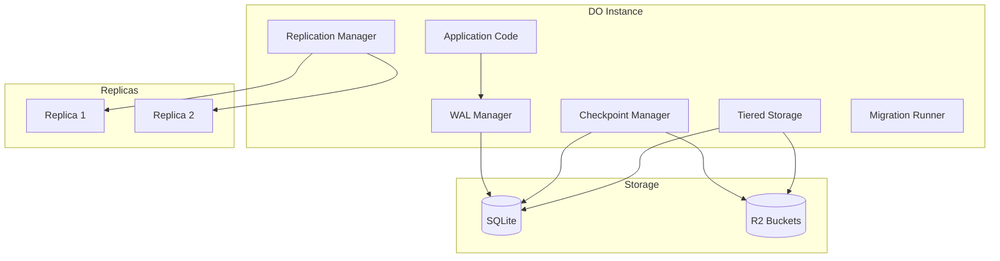
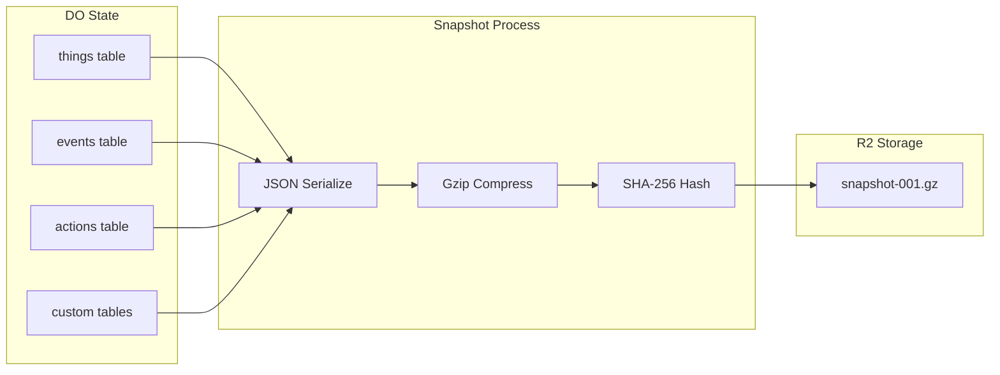
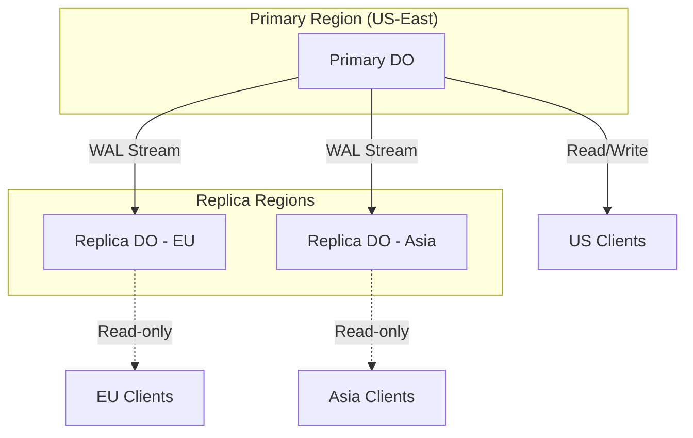
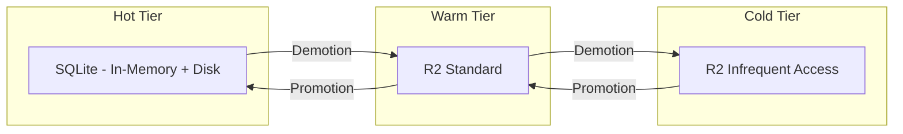

import { Callout } from 'fumadocs-ui/components/callout'

# DO Persistence Layer

dotdo provides a comprehensive persistence layer for Durable Objects, ensuring data durability, crash recovery, and high availability. This guide covers the internal mechanisms that protect your data.

## Overview

The persistence layer consists of five integrated components:

| Component | Purpose |
|-----------|---------|
| **WAL Manager** | Write-ahead logging for crash recovery |
| **Checkpoint Manager** | Periodic snapshots for point-in-time recovery |
| **Replication Manager** | Cross-DO state replication for HA |
| **Tiered Storage Manager** | Hot/warm/cold data tiering |
| **Migration Runner** | Schema versioning and migrations |



---

## Write-Ahead Log (WAL)

The WAL ensures durability by logging all changes before applying them. If a DO crashes mid-operation, the WAL enables complete recovery.

### How WAL Works

```
┌─────────────────────────────────────────────────────────────┐
│                     Write Operation                          │
└─────────────────────────────────────────────────────────────┘
                              │
                              ▼
┌─────────────────────────────────────────────────────────────┐
│               1. Log to WAL (before apply)                   │
│                                                              │
│   LSN: 1001                                                  │
│   Operation: INSERT                                          │
│   Table: users                                               │
│   Payload: {name: "Alice", email: "alice@example.com"}       │
│   Checksum: sha256(...)                                      │
└─────────────────────────────────────────────────────────────┘
                              │
                              ▼
┌─────────────────────────────────────────────────────────────┐
│               2. Apply to SQLite                             │
└─────────────────────────────────────────────────────────────┘
                              │
                              ▼
┌─────────────────────────────────────────────────────────────┐
│               3. Mark WAL entry as flushed                   │
└─────────────────────────────────────────────────────────────┘
```

### WAL Entry Structure

Each WAL entry contains complete information for replay:

```typescript
interface WALEntry {
  /** Log Sequence Number - monotonically increasing */
  lsn: number
  /** Operation type: INSERT, UPDATE, DELETE, BATCH, TX_*, etc. */
  operation: WALOperationType
  /** Target table name */
  table: string
  /** Row/record ID (for single-row ops) */
  recordId?: string
  /** Operation payload (binary) */
  payload: Uint8Array
  /** Transaction ID if part of a transaction */
  transactionId?: string
  /** Schema version at time of write */
  schemaVersion: number
  /** Unix timestamp */
  createdAt: number
  /** Whether entry has been flushed to durable storage */
  flushed: boolean
  /** SHA-256 checksum for integrity verification */
  checksum: string
}
```

### Using the WAL Manager

```typescript
import { WALManager } from '@dotdo/persistence'

class MyDO extends DO {
  private wal: WALManager

  constructor(state: DurableObjectState, env: Env) {
    super(state, env)

    this.wal = new WALManager(state.storage, {
      schemaVersion: 1,
      config: {
        syncMode: 'async',        // 'sync' for immediate fsync
        maxSizeBytes: 10_000_000, // 10MB before forced checkpoint
        maxEntries: 1000,         // Entries before forced checkpoint
        verifyChecksums: true,    // Verify on read
      }
    })
  }

  async initialize() {
    await this.wal.initialize()
    this.wal.start() // Start background sync
  }

  async createUser(data: UserData): Promise<User> {
    // Log to WAL before applying
    const payload = new TextEncoder().encode(JSON.stringify(data))
    const lsn = await this.wal.append('INSERT', 'users', payload)

    // Apply to SQLite
    const user = await this.db.insert(users).values(data).returning()

    return user
  }
}
```

### Sync Modes

| Mode | Behavior | Use Case |
|------|----------|----------|
| `sync` | fsync after each write | Maximum durability, lower throughput |
| `async` | Batch fsync at intervals | Higher throughput, brief window of data loss risk |

```typescript
// Sync mode - immediate durability
const wal = new WALManager(storage, {
  config: { syncMode: 'sync' }
})

// Async mode - batched durability (default)
const wal = new WALManager(storage, {
  config: {
    syncMode: 'async',
    asyncSyncIntervalMs: 100, // Batch sync every 100ms
  }
})
```

### Transactions

The WAL supports ACID transactions with savepoints:

```typescript
// Begin transaction
const txId = await wal.beginTransaction()

try {
  // Log operations within transaction
  await wal.append('UPDATE', 'accounts', debitPayload, txId)
  await wal.append('UPDATE', 'accounts', creditPayload, txId)
  await wal.append('INSERT', 'transfers', transferPayload, txId)

  // Commit
  await wal.commitTransaction(txId)
} catch (error) {
  // Rollback removes all transaction entries
  await wal.rollbackTransaction(txId)
  throw error
}
```

#### Savepoints for Partial Rollback

```typescript
const txId = await wal.beginTransaction()

await wal.append('INSERT', 'orders', orderPayload, txId)

// Create savepoint before risky operation
const sp = await wal.createSavepoint(txId, 'before-inventory')

try {
  await wal.append('UPDATE', 'inventory', decrementPayload, txId)
} catch {
  // Rollback to savepoint (keeps order insert)
  await wal.rollbackToSavepoint(txId, 'before-inventory')
}

await wal.commitTransaction(txId)
```

### Crash Recovery

On restart, the WAL replays uncommitted entries:

```typescript
async function recoverFromCrash() {
  const result = await wal.recover({
    onReplay: (entry) => {
      // Re-apply each entry to SQLite
      applyToDatabase(entry)
    }
  })

  console.log(`Recovered ${result.entriesRecovered} entries`)
  console.log(`${result.transactionsRolledBack} incomplete transactions rolled back`)
}
```

Recovery guarantees:

- **Committed transactions**: Fully replayed
- **Uncommitted transactions**: Rolled back
- **Corrupted entries**: Skipped with error logged

<Callout type="info">
The WAL automatically truncates entries older than the last checkpoint. This keeps WAL size bounded.
</Callout>

---

## Checkpoints

Checkpoints mark consistent points in the WAL where all preceding operations are guaranteed durable. Combined with snapshots, they enable point-in-time recovery.

### Checkpoint vs Snapshot

| Concept | Purpose | Storage |
|---------|---------|---------|
| **Checkpoint** | Marks WAL position as durable | SQLite metadata |
| **Snapshot** | Full state dump at checkpoint | R2 (compressed) |

### Creating Checkpoints

```typescript
import { CheckpointManager } from '@dotdo/persistence'

const checkpoint = new CheckpointManager(
  state.storage,
  env,
  'my-do-namespace',
  {
    schemaVersion: 1,
    config: {
      intervalMs: 300_000,      // Checkpoint every 5 minutes
      maxWalEntries: 1000,      // Force checkpoint after 1000 WAL entries
      createSnapshots: true,    // Create snapshots at each checkpoint
      maxSnapshots: 10,         // Retain last 10 snapshots
      snapshotRetentionMs: 7 * 24 * 60 * 60 * 1000, // 7 days
      compressSnapshots: true,  // Gzip compression
    }
  }
)

// Start automatic checkpointing
checkpoint.start()

// Notify of WAL entries (for auto-checkpoint triggers)
wal.onSync(() => {
  checkpoint.onWalEntry(wal.currentLsn)
})
```

### Checkpoint Structure

```typescript
interface Checkpoint {
  /** Unique checkpoint ID */
  id: string
  /** DO namespace */
  ns: string
  /** WAL position (LSN) at checkpoint */
  walPosition: number
  /** Schema version */
  schemaVersion: number
  /** Unix timestamp */
  createdAt: number
  /** Associated snapshot ID */
  snapshotId?: string
  /** Whether checkpoint has been verified */
  verified: boolean
}
```

### Manual Checkpoints

```typescript
// Force a checkpoint
const cp = await checkpoint.createCheckpoint(currentWalPosition)

// Query checkpoints
const latest = await checkpoint.getLatestCheckpoint()
const all = await checkpoint.getCheckpoints({ order: 'desc', limit: 5 })

// Find checkpoint for specific WAL position
const cpForLsn = await checkpoint.getCheckpointForWalPosition(1500)
```

### Snapshots

Snapshots capture complete state at a checkpoint:



```typescript
// Create snapshot manually
const snapshot = await checkpoint.createSnapshot()

console.log(`Snapshot ${snapshot.id}`)
console.log(`Size: ${snapshot.sizeBytes} bytes`)
console.log(`Checksum: ${snapshot.checksum}`)

// List all snapshots
const snapshots = await checkpoint.getSnapshots()

// Verify snapshot integrity
const isValid = await checkpoint.verifyChecksum(snapshot)
```

### Point-in-Time Recovery

Restore to a previous checkpoint:

```typescript
// Get checkpoint to restore to
const targetCheckpoint = await checkpoint.getCheckpointForWalPosition(1500)

// Restore (validates checksum, decompresses, applies to SQLite)
await checkpoint.restoreToCheckpoint(targetCheckpoint)

// Or restore from specific snapshot
await checkpoint.restoreFromSnapshotId('snap-abc123')
```

<Callout type="warning">
Restore operations clear current data before applying the snapshot. Ensure you have a backup of current state if needed.
</Callout>

---

## Replication

The replication manager enables cross-DO state synchronization for high availability and geographic distribution.

### Replication Topology



### Replication Modes

| Mode | Behavior | Consistency | Latency |
|------|----------|-------------|---------|
| `sync` | Wait for all replicas | Strong | Higher |
| `async` | Fire-and-forget | Eventual | Lower |
| `lazy` | Sync on first read | Eventual | Lowest until first read |

### Setting Up Replication

```typescript
import { ReplicationManager } from '@dotdo/persistence'

// Primary DO
class PrimaryDO extends DO {
  private replication: ReplicationManager

  constructor(state: DurableObjectState, env: Env) {
    super(state, env)

    this.replication = new ReplicationManager(env, 'primary-ns', {
      config: {
        mode: 'async',
        maxLag: 100,           // Max WAL entries before forcing sync
        syncIntervalMs: 5000,  // Background sync every 5s
        compress: true,        // Compress replication data
      }
    })
  }

  async initialize() {
    await this.replication.setPrimary()

    // Register replicas
    await this.replication.registerReplica('replica-eu')
    await this.replication.registerReplica('replica-asia')

    this.replication.start()
  }

  async writeData(key: string, value: unknown) {
    const result = await this.replication.write(key, value)

    if (result.acknowledged) {
      console.log('Write replicated to all replicas')
    } else if (result.queued) {
      console.log('Write queued for async replication')
    }
  }
}
```

### Replica Configuration

```typescript
// Replica DO
class ReplicaDO extends DO {
  private replication: ReplicationManager

  async initialize() {
    await this.replication.setReplica('primary-ns')
    this.replication.start()
  }

  async readData(key: string) {
    // In lazy mode, triggers sync on first read
    return this.replication.read(key)
  }

  // Replicas are read-only by default
  async writeData(key: string, value: unknown) {
    // Forward write to primary
    await this.replication.writeViaForward(key, value)
  }
}
```

### Monitoring Replication

```typescript
// Get replication state
const state = await replication.getState()
console.log(`Role: ${state.role}`)           // 'primary' | 'replica' | 'standalone'
console.log(`Status: ${state.status}`)       // 'active' | 'syncing' | 'stale' | 'error'
console.log(`Lag: ${state.lag} entries`)

// Get replica-specific lag
const euLag = await replication.getReplicaLag('replica-eu')

// Force sync
const result = await replication.sync()
console.log(`Synced ${result.entriesSynced} entries in ${result.durationMs}ms`)
```

### Conflict Resolution

When replicas diverge (rare in normal operation), conflicts are resolved using configurable strategies:

```typescript
// Set conflict resolution strategy
replication.setConflictStrategy('primary-wins')

// Available strategies:
// - 'primary-wins': Primary version always wins
// - 'replica-wins': Replica version wins (for local-first)
// - 'last-write-wins': Most recent timestamp wins
// - 'custom': Implement custom resolver

// Get conflict history
const conflicts = await replication.getConflictHistory()
```

### Failover

Promote a replica to primary if the original primary fails:

```typescript
// Check if promotion is safe
const state = await replication.getState()

if (state.lag <= 10) {
  // Low lag - safe to promote
  await replication.promote()
  console.log('Promoted to primary')
} else {
  // High lag - sync first
  await replication.sync()
  await replication.promote()
}

// Demote old primary (if recovered)
await oldPrimary.demote()
```

---

## Tiered Storage

The tiered storage manager automatically moves data between storage tiers based on access patterns, optimizing cost and performance.

### Storage Tiers



| Tier | Storage | Access Time | Cost | Use Case |
|------|---------|-------------|------|----------|
| **Hot** | SQLite | \<1ms | Highest | Frequently accessed |
| **Warm** | R2 Standard | ~50ms | Medium | Occasional access |
| **Cold** | R2 Archive | ~100ms | Lowest | Rarely accessed |

### Configuring Tiered Storage

```typescript
import { TieredStorageManager } from '@dotdo/persistence'

const tiered = new TieredStorageManager(
  state.storage,
  env,
  {
    config: {
      hotRetentionMs: 5 * 60 * 1000,     // 5 min in hot tier
      warmRetentionMs: 30 * 24 * 60 * 60 * 1000, // 30 days in warm
      hotAccessThreshold: 10,             // Promote to hot after 10 accesses
      autoPromote: true,                  // Auto-promote frequently accessed
      compressCold: true,                 // Gzip cold tier data
    }
  }
)
```

### Writing Data

```typescript
// Write to hot tier (default)
await tiered.put('user:123', userData)

// Write directly to warm tier
await tiered.putToTier('archive:old-data', data, 'warm')

// Write directly to cold tier
await tiered.putToTier('backup:2024-01', backup, 'cold')
```

### Reading Data

```typescript
// Reads check hot -> warm -> cold automatically
const data = await tiered.get('user:123')

// Get data location
const location = await tiered.getLocation('user:123')
console.log(`Tier: ${location.tier}`)
console.log(`Access count: ${location.accessCount}`)
console.log(`Last accessed: ${location.lastAccessAt}`)
```

### Automatic Demotion

Run periodic demotion to move cold data to cheaper tiers:

```typescript
// Run demotion (e.g., via alarm)
async alarm() {
  const result = await tiered.runDemotion()

  console.log(`Demoted ${result.itemsDemoted} items`)
  console.log(`Transferred ${result.bytesTransferred} bytes`)
  console.log(`From ${result.fromTier} to ${result.toTier}`)

  // Schedule next demotion run
  await this.ctx.storage.setAlarm(Date.now() + 60 * 60 * 1000) // 1 hour
}
```

### Manual Promotion

```typescript
// Promote specific item to hot tier
const result = await tiered.promote('archive:important-data', 'hot')

if (result.itemsPromoted > 0) {
  console.log(`Promoted from ${result.fromTier}`)
}
```

### Statistics

```typescript
// Get tier distribution
const stats = await tiered.getStats()
console.log(`Hot: ${stats.hot} items`)
console.log(`Warm: ${stats.warm} items`)
console.log(`Cold: ${stats.cold} items`)

// Get size distribution
const sizes = await tiered.getSizeStats()
console.log(`Hot: ${sizes.hot} bytes`)

// Get access statistics
const access = await tiered.getAccessStats()
console.log(`Total reads: ${access.totalReads}`)
console.log(`Hot hits: ${access.hotHits}`)
console.log(`Cold hits: ${access.coldHits}`)
```

---

## Schema Migrations

The migration runner handles schema versioning with safe rollback support.

### Defining Migrations

```typescript
import { MigrationRunner } from '@dotdo/persistence'

const migrations = new MigrationRunner(state.storage, {
  config: {
    autoMigrate: false,
    backupBeforeMigration: true,
    transactionMode: 'each', // 'each' or 'all'
  }
})

// Register migrations
migrations.register({
  version: 1,
  name: 'create-users-table',
  createdAt: Date.now(),
  checksum: '',
  up: [
    {
      type: 'sql',
      sql: `CREATE TABLE users (
        id TEXT PRIMARY KEY,
        email TEXT UNIQUE NOT NULL,
        created_at INTEGER NOT NULL
      )`
    }
  ],
  down: [
    { type: 'sql', sql: 'DROP TABLE users' }
  ]
})

migrations.register({
  version: 2,
  name: 'add-users-name',
  createdAt: Date.now(),
  checksum: '',
  up: [
    { type: 'sql', sql: 'ALTER TABLE users ADD COLUMN name TEXT' }
  ],
  down: [
    // SQLite doesn't support DROP COLUMN - need to recreate
    { type: 'sql', sql: 'ALTER TABLE users DROP COLUMN name' }
  ]
})
```

### Running Migrations

```typescript
// Initialize (creates migration tracking tables)
await migrations.initialize()

// Check pending migrations
const pending = await migrations.getPendingMigrations()
console.log(`${pending.length} migrations pending`)

// Run all pending migrations
const results = await migrations.runAll()

for (const result of results) {
  if (result.status === 'completed') {
    console.log(`Migration ${result.version} completed in ${result.durationMs}ms`)
  } else {
    console.error(`Migration ${result.version} failed: ${result.error}`)
  }
}

// Or run a specific migration
const result = await migrations.run(2)
```

### Rollback

```typescript
// Rollback single migration
await migrations.rollback(2)

// Rollback to specific version
await migrations.rollbackTo(1) // Rolls back versions 3, 2

// Rollback all
await migrations.rollbackAll()
```

### Validation

```typescript
// Validate checksums (detect modified migrations)
const checksumResult = await migrations.validateChecksums()
if (!checksumResult.valid) {
  console.error(`Modified migrations: ${checksumResult.mismatches}`)
}

// Validate version sequence (detect gaps)
const versionResult = migrations.validateVersions()
if (!versionResult.valid) {
  console.warn(`Missing versions: ${versionResult.gaps}`)
}
```

### Transform Functions

For complex migrations that need data transformation:

```typescript
migrations.registerTransform('encrypt-emails', async (table, params) => {
  const rows = storage.sql.exec(`SELECT id, email FROM ${table}`)

  for (const row of rows.toArray()) {
    const encrypted = await encrypt(row.email, params.key)
    storage.sql.exec(
      `UPDATE ${table} SET email = ? WHERE id = ?`,
      encrypted,
      row.id
    )
  }
})

migrations.register({
  version: 3,
  name: 'encrypt-user-emails',
  createdAt: Date.now(),
  checksum: '',
  up: [
    {
      type: 'transform',
      transform: 'encrypt-emails',
      table: 'users',
      params: { key: 'secret-key' }
    }
  ],
  down: [
    // Decryption transform...
  ]
})
```

---

## Best Practices

### 1. Always Enable WAL

```typescript
// Enable WAL for any DO with important state
const wal = new WALManager(storage, { config: { syncMode: 'async' } })
await wal.initialize()
```

### 2. Configure Checkpoints

```typescript
// Balance checkpoint frequency with performance
const checkpoint = new CheckpointManager(storage, env, ns, {
  config: {
    intervalMs: 300_000,      // 5 minutes
    maxWalEntries: 1000,      // Or after 1000 writes
    createSnapshots: true,    // Enable snapshots for disaster recovery
  }
})
```

### 3. Use Transactions for Atomic Operations

```typescript
// BAD: Partial failure leaves inconsistent state
await wal.append('UPDATE', 'accounts', debitPayload)
await wal.append('UPDATE', 'accounts', creditPayload) // Fails here

// GOOD: Transaction ensures all-or-nothing
const txId = await wal.beginTransaction()
await wal.append('UPDATE', 'accounts', debitPayload, txId)
await wal.append('UPDATE', 'accounts', creditPayload, txId)
await wal.commitTransaction(txId)
```

### 4. Monitor Replication Lag

```typescript
// Alert on high replication lag
const state = await replication.getState()
if (state.lag > 50) {
  await alertOps('High replication lag', { lag: state.lag })
  await replication.sync() // Force sync
}
```

### 5. Use Tiered Storage for Cost Optimization

```typescript
// Move old data to cold storage
const oldThreshold = Date.now() - 30 * 24 * 60 * 60 * 1000 // 30 days

const oldItems = await things.list({
  filter: { createdAt: { lt: oldThreshold } }
})

for (const item of oldItems) {
  await tiered.putToTier(`archive:${item.id}`, item, 'cold')
  await things.delete(item.id)
}
```

---

## Related

<Cards>
  <Card title="Durable Objects Deep Dive" href="/docs/architecture/durable-objects">
    DO lifecycle, state management, and WebSocket handling.
  </Card>
  <Card title="Data Model" href="/docs/architecture/data-model">
    Things, relationships, events, and actions schema.
  </Card>
  <Card title="Edge Computing" href="/docs/architecture/edge-computing">
    Global distribution and latency optimization.
  </Card>
</Cards>
