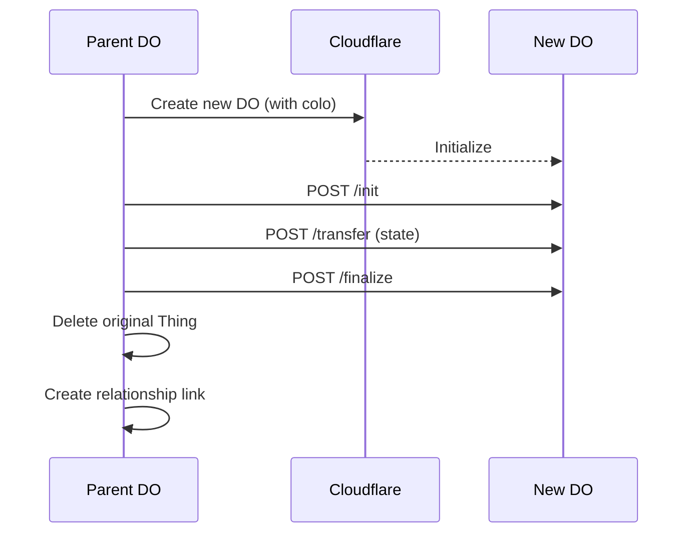
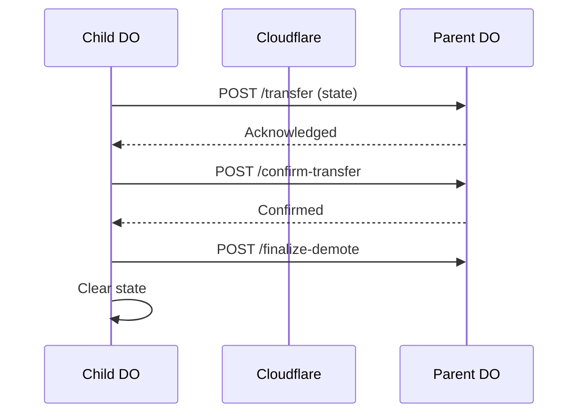

# Promote/Demote

Not everything needs its own Durable Object. Most entities start as Things inside a parent DO. When they get hot (high traffic, large state), promote them to their own DO. When they cool down, demote them back.

## The Concept

```
Parent DO (10GB limit)
  ├── Customer A (Thing) ─────────────┐
  ├── Customer B (Thing)              │ promote()
  ├── Customer C (Thing)              ▼
  └── ...                        Customer A DO (10GB)
                                      │
                         demote() ────┘
```

## Promoting a Thing

```typescript
// Promote a Thing to its own DO
const newDO = await customer.promote({
  namespace: 'https://customers.acme.com',
  colo: 'Frankfurt',        // GDPR compliance
  preserveHistory: true,    // Migrate actions/events
  linkParent: true,         // Maintain parent relationship
})

console.log(newDO)
// {
//   ns: 'https://abc123.do',
//   doId: 'abc123',
//   previousId: 'customer-456',
//   actionsMigrated: 42,
//   eventsMigrated: 128,
//   parentLinked: true
// }
```

### Promotion Options

| Option | Type | Default | Description |
|--------|------|---------|-------------|
| `namespace` | string | auto | Target DO namespace |
| `colo` | string | - | IATA code for placement |
| `region` | string | - | Geographic region hint |
| `preserveHistory` | boolean | `true` | Migrate actions and events |
| `linkParent` | boolean | `true` | Create parent relationship |
| `type` | string | 'DO' | DO class type |

### Colo Targeting

```typescript
// Place in a specific city for compliance
await customer.promote({
  colo: 'fra',              // Frankfurt (IATA)
})

// Or use the city name
await customer.promote({
  colo: 'Frankfurt',
})

// Or specify a region
await customer.promote({
  region: 'eu-west',
})
```

### What Gets Migrated

When you promote a Thing:

1. **State**: All data from the Thing moves to the new DO
2. **Actions**: If `preserveHistory: true`, related actions migrate
3. **Events**: If `preserveHistory: true`, related events migrate
4. **Relationships**: Outbound relationships update to point to new DO

The original Thing is deleted from the parent DO.

## Demoting a DO

```typescript
// Fold a DO back into its parent
const result = await customer.demote({
  preserveHistory: true,
  compress: false,
})

console.log(result)
// {
//   thingId: 'demoted-1704...abc',
//   parentNs: 'https://acme.do',
//   deletedNs: 'https://customer-456.do'
// }
```

### Demote Options

| Option | Type | Default | Description |
|--------|------|---------|-------------|
| `thingId` | string | auto | ID for the demoted Thing |
| `preserveHistory` | boolean | `true` | Keep actions and events |
| `compress` | boolean | `false` | Only keep critical events |
| `mode` | 'atomic' \| 'staged' | `'atomic'` | Demotion mode |
| `preserveId` | boolean | `false` | Derive ID from namespace |

### Staged Demotion

For large DOs, use staged demotion with a two-phase commit:

```typescript
// Phase 1: Prepare
const { stagedToken } = await customer.demote({
  mode: 'staged',
  compress: true,
})

// Token valid for 5 minutes
console.log(`Staged token: ${stagedToken}`)

// Phase 2a: Commit
await customer.commitDemote(stagedToken)

// Phase 2b: Or abort
await customer.abortDemote(stagedToken, 'Changed my mind')
```

## When to Promote

### High Write Volume

```typescript
// Monitor writes per minute
const writesPerMinute = await thing.getWriteRate()

if (writesPerMinute > 1000) {
  await thing.promote({ colo: nearestColo(request) })
}
```

### Large State

```typescript
// Check thing size
const sizeBytes = await thing.getStateSize()

if (sizeBytes > 100 * 1024 * 1024) {  // 100MB
  await thing.promote()
}
```

### Data Residency

```typescript
// EU customer needs EU placement
if (customer.data.region === 'eu') {
  await customer.promote({
    colo: 'Frankfurt',
    namespace: 'https://eu-customers.acme.com'
  })
}
```

### Isolation Requirements

```typescript
// High-value customer needs isolation
if (customer.data.plan === 'enterprise') {
  await customer.promote({
    namespace: `https://${customer.id}.enterprise.acme.com`
  })
}
```

## When to Demote

### Cooling Down

```typescript
// Customer hasn't been active
const lastAccess = await customer.getLastAccessTime()
const daysSinceAccess = (Date.now() - lastAccess) / (1000 * 60 * 60 * 24)

if (daysSinceAccess > 30) {
  await customer.demote({ compress: true })
}
```

### Cost Optimization

```typescript
// Batch demote inactive DOs
const inactiveCustomers = await getInactiveCustomers({ threshold: '30d' })

for (const customer of inactiveCustomers) {
  await customer.demote({
    compress: true,
    preserveHistory: false,  // Drop old events
  })
}
```

### Consolidation

```typescript
// Merge small customers into shared DO
if (customer.data.plan === 'free' && customer.getThingCount() < 10) {
  await customer.demote()
}
```

## Implementation Details

### Promote Flow



### Demote Flow



### Atomicity

Both promote and demote use `blockConcurrencyWhile` to ensure atomic operations:

```typescript
return this.ctx.blockConcurrencyWhile(async () => {
  // All operations here are atomic
  await this.emitEvent('promote.started', { ... })
  // ... transfer data ...
  await this.emitEvent('promote.completed', { ... })
})
```

## Error Handling

### Promote Failures

```typescript
try {
  await customer.promote({ colo: 'fra' })
} catch (error) {
  if (error.message.includes('already promoted')) {
    // Thing was already promoted
    console.log('Customer already has dedicated DO')
  } else if (error.message.includes('DO binding unavailable')) {
    // Configuration issue
    console.error('Check wrangler.toml bindings')
  }
}
```

### Demote Failures

```typescript
try {
  await customer.demote()
} catch (error) {
  if (error.message.includes('circular relationship')) {
    // Can't demote into child
    console.error('Cannot demote into a child DO')
  } else if (error.message.includes('Transfer failed')) {
    // Network or parent DO issue
    await retry(() => customer.demote())
  }
}
```

## Events

Both operations emit events for observability:

```typescript
// Promote events
$.on.promote.started(({ thingId, correlationId }) => { ... })
$.on.promote.completed(({ ns, doId, actionsMigrated }) => { ... })
$.on.promote.failed(({ error }) => { ... })

// Demote events
$.on.demote.started(({ targetNs, compress }) => { ... })
$.on.demote.completed(({ thingId, parentNs }) => { ... })
$.on.demote.failed(({ error }) => { ... })
```

## Limits

| Limit | Value |
|-------|-------|
| Max promotion depth | Unlimited |
| Max demote state size | 10GB |
| Staged token validity | 5 minutes |
| Concurrent promotions per Thing | 1 |

## Related

- [Sharding](/docs/deployment/sharding) - Horizontal scaling
- [Geo-Replication](/docs/deployment/geo-replication) - Multi-region deployment
- [Thing](/docs/sdk/thing) - Base entity type
