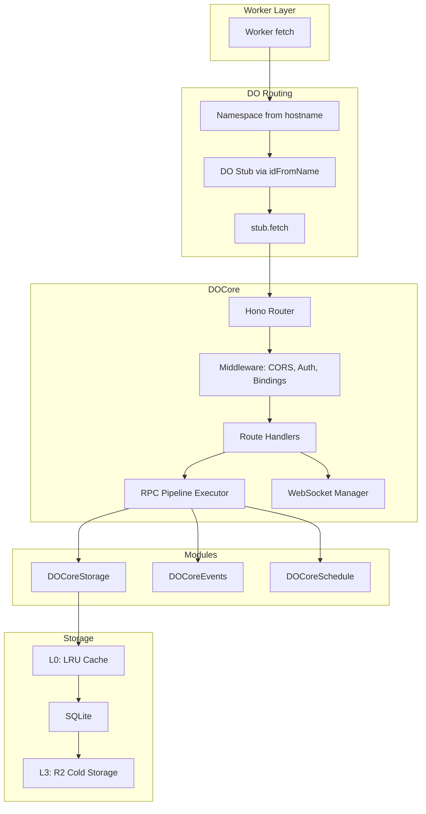
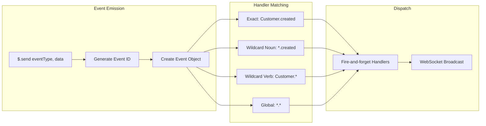
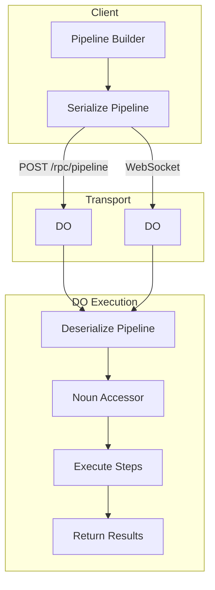
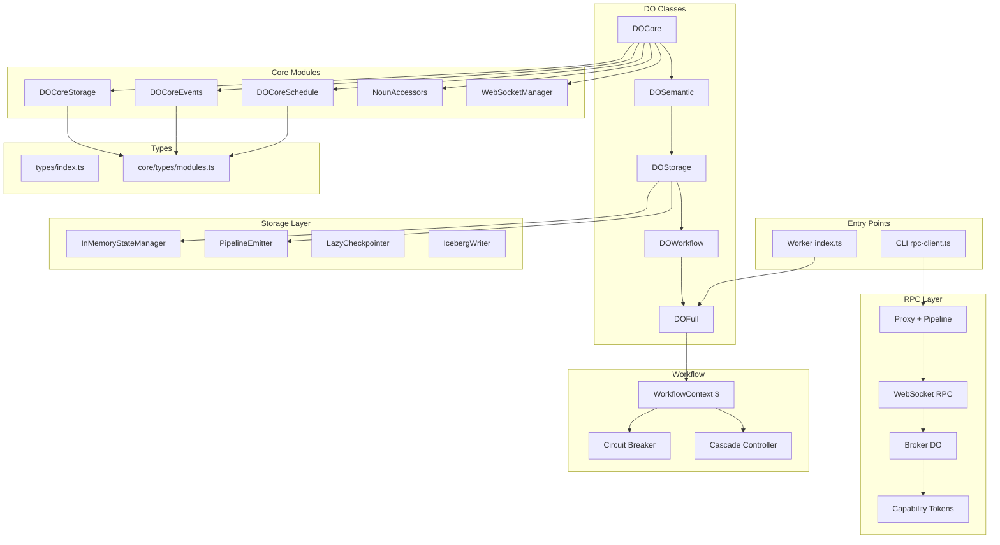

# Architecture Review: dotdo v2

**Date:** 2026-01-17
**Reviewer:** Claude Opus 4.5
**Version:** v2 worktree (main branch)

---

## Executive Summary

The dotdo v2 architecture represents a well-structured Durable Objects framework with strong separation of concerns and an innovative modular approach. The codebase demonstrates sophisticated patterns for storage, RPC, and workflow management while maintaining reasonable complexity bounds.

**Overall Grade: B+**

The architecture excels at modularity and extensibility but has some coupling concerns in the inheritance hierarchy and room for improvement in dependency management.

---

## 1. Modularity (Grade: A-)

### Strengths

**Excellent Module Extraction Pattern**

The `core/modules/` directory demonstrates exemplary separation of concerns:

```
core/
├── DOCore.ts           # Coordinator class
├── modules/
│   ├── storage.ts      # DOCoreStorage - Thing CRUD via RpcTarget
│   ├── events.ts       # DOCoreEvents - Event system via RpcTarget
│   ├── schedule.ts     # DOCoreSchedule - CRON management via RpcTarget
│   └── index.ts
└── types/
    └── modules.ts      # Clean interface contracts (IStorage, IEvents, ISchedule)
```

Each module:
- Extends `RpcTarget` for direct RPC exposure
- Implements a clean interface (`IStorage`, `IEvents`, `ISchedule`)
- Has single responsibility
- Is lazily initialized by DOCore

**Type-Safe Contracts**

`core/types/modules.ts` provides comprehensive JSDoc-documented interfaces (1300+ lines) with:
- Query operators (`$gt`, `$eq`, `$in`, `$regex`, etc.)
- Storage options (`StorageQueryOptions`, `BulkFilterOptions`)
- Event patterns (`OnProxy`, `EventHandler`)
- Schedule builders (`TimeBuilder`, `IntervalBuilder`)

**Clean Canonical Types**

`types/index.ts` serves as single source of truth with:
- Branded ID types (`ThingId`, `EventId`, `RelationshipId`)
- Core data types (`ThingData`, `Thing`, `Event`)
- Semantic types (`Noun`, `Verb`, `Action`)
- Workflow context types (`CascadeOptions`, `CascadeResult`)

### Weaknesses

- Some duplication between `types/index.ts` and `core/types/modules.ts`
- Event and Schedule types defined in both locations

### Recommendations

1. Consider consolidating all type definitions into a single source
2. Use barrel exports more consistently

---

## 2. Scalability (Grade: B+)

### Strengths

**Four-Tier Storage Architecture**

`storage/DOStorage.ts` implements a sophisticated caching strategy:

```
L0: InMemoryStateManager  - Fast O(1) CRUD with LRU eviction
L1: PipelineEmitter (WAL) - Fire-and-forget event emission
L2: LazyCheckpointer      - Batched SQLite persistence
L3: IcebergWriter         - R2 cold storage
```

Write path: Client -> L0 -> L1 (ACK) -> lazy L2 -> eventual L3
Read path: L0 (hit?) -> L2 (hit?) -> L3 (restore)

**Fanout Distributed Queries**

`fanout/` provides scatter-gather patterns:
- `ConsistentHashRing` - Deterministic shard routing
- `QueryCoordinator` - Parallel query execution
- `SubrequestBudget` - Cloudflare subrequest limit management
- `merge` - Result aggregation

**Namespace-Based Isolation**

Worker routing derives namespace from hostname:
```typescript
const hostParts = url.hostname.split('.')
const ns = hostParts.length > 2 ? hostParts[0] : 'default'
const id = env.DOFull.idFromName(ns)
```

**Circuit Breaker for Cascade Tiers**

`workflow/workflow-context.ts` includes per-tier circuit breakers:
- Configurable failure threshold
- Reset timeout with half-open state
- Persistent state via SQLite for cold start recovery

### Weaknesses

- No explicit sharding strategy documentation
- Single-DO bottleneck for high-traffic namespaces
- Cold start recovery complexity

### Recommendations

1. Document sharding patterns for high-scale scenarios
2. Consider hierarchical DO routing for load distribution
3. Add warm start hints for frequently accessed DOs

---

## 3. Extensibility (Grade: A)

### Strengths

**Inheritance Hierarchy for Progressive Enhancement**

```
DurableObject
    |
DOCore           (~40KB) - Base: SQLite, Hono router, RPC modules
    |
DOSemantic       (+8KB)  - Noun/Verb, Relationships, Semantic queries
    |
DOStorage        (+15KB) - 4-tier storage, Pipeline WAL
    |
DOWorkflow       (+10KB) - WorkflowContext ($), Cascade
    |
DOFull           (+10KB) - AI, Streaming, Human-in-loop
```

Each layer adds capabilities without modifying lower layers.

**RpcTarget Modules Enable Composition**

Modules like `DOCoreStorage`, `DOCoreEvents`, `DOCoreSchedule`:
- Can be used standalone or composed
- Enable selective feature adoption
- Support dependency injection for testing

**Fluent DSL Builders**

Schedule and event APIs use Proxy-based DSLs:
```typescript
// Schedule DSL
$.every.Monday.at9am(handler)
$.every(5).minutes(handler)

// Event DSL
$.on.Customer.created(handler)
$.on['*'].deleted(handler)  // Wildcard support
```

**Plugin Points**

- `NounAccessor` and `NounInstanceAccessor` classes for custom data accessors
- `tierHandlers` Map for custom cascade tier implementations
- WebSocket message handlers are extensible

### Weaknesses

- Deep inheritance can complicate debugging
- Some cross-cutting concerns (auth, logging) not fully abstracted

### Recommendations

1. Consider composition over inheritance for optional features
2. Implement middleware/hook system for cross-cutting concerns
3. Add plugin registration API

---

## 4. Dependencies (Grade: B)

### Strengths

**Minimal External Dependencies**

Core dependencies:
- `hono` - Minimal router (~12KB)
- `cloudflare:workers` - Platform RPC primitives

No heavy frameworks or ORM dependencies.

**Internal Module Boundaries**

Clear dependency directions:
```
types/index.ts <- core/types/modules.ts <- core/modules/*
                                        <- workflow/workflow-context.ts
                                        <- objects/DOFull.ts
```

### Weaknesses

**Circular Dependency Risk**

The following modules have bidirectional awareness:
- `DOCoreStorage` needs `StorageEventEmitter` interface
- `DOCoreEvents` needs `WebSocketRpcHandler` and `DurableObjectState`

**Tight Coupling in RPC Layer**

`rpc/` directory has 25+ files with complex interdependencies:
- `proxy.ts` (26KB)
- `websocket-rpc.ts` (23KB)
- `broker-do.ts` (17KB)
- `negotiation.ts` (17KB)

### Module Coupling Analysis

```
High Coupling (many dependents):
- types/index.ts           - 20+ importers
- core/DOCore.ts           - 15+ importers
- rpc/proxy.ts             - 10+ importers

Medium Coupling:
- workflow/workflow-context.ts
- core/modules/storage.ts
- rpc/websocket-rpc.ts

Low Coupling:
- fanout/*
- mcp/*
- streaming/*
```

### Recommendations

1. Extract RPC layer into separate package with clear API surface
2. Use dependency injection for event emitter in storage module
3. Consider facade pattern for RPC complexity

---

## 5. Data Flow (Grade: B+)

### Request Handling Flow



### Event Flow



### RPC Pipeline Flow



### Strengths

- Clear unidirectional data flow from worker to DO
- Event system supports both sync and async handlers
- Pipeline executor enables batched operations
- WebSocket hibernation support for efficient long-lived connections

### Weaknesses

- No explicit transaction boundaries documented
- Error propagation patterns vary across modules
- Callback serialization over RPC requires careful handling

### Recommendations

1. Document transaction semantics for multi-step operations
2. Standardize error types across all modules
3. Add tracing/correlation IDs for distributed debugging

---

## Component Diagram



---

## Technical Debt Inventory

### Critical (Address Immediately)

| Item | Location | Description | Impact |
|------|----------|-------------|--------|
| Test file creation | Multiple locations | New test files not following project structure | Consistency |
| RPC complexity | `rpc/proxy.ts` (26KB) | Single file too large, needs decomposition | Maintainability |

### High Priority (Address This Quarter)

| Item | Location | Description | Impact |
|------|----------|-------------|--------|
| Type duplication | `types/` vs `core/types/` | Same types defined in multiple places | Maintenance burden |
| Error handling inconsistency | Throughout | Mix of throw, return null, and error objects | Developer experience |
| Missing integration tests | `objects/tests/` | DO module integration not fully tested | Reliability |
| Inheritance depth | DO class hierarchy | 5-level inheritance can be hard to trace | Debugging |

### Medium Priority (Backlog)

| Item | Location | Description | Impact |
|------|----------|-------------|--------|
| Cold start optimization | `DOStorage` | Recovery from L3 could be faster | Performance |
| WebSocket state management | `DOFull` | Client state maps grow unbounded | Memory |
| Schedule persistence | `DOCoreSchedule` | Handlers can't be persisted, need re-registration | Developer experience |
| Auth middleware patterns | `lib/auth-middleware.ts` | Inconsistent auth requirement patterns | Security |

### Low Priority (Nice to Have)

| Item | Location | Description | Impact |
|------|----------|-------------|--------|
| Missing JSDoc | Various | Some public APIs lack documentation | Developer experience |
| Metrics/observability | Scattered | No centralized metrics collection | Operations |
| Plugin system | Not implemented | No formal plugin registration API | Extensibility |

---

## Top Recommendations

### 1. Consolidate Type Definitions

Create a single source of truth for all types:

```typescript
// types/index.ts - ALL types
export * from './branded-ids'
export * from './thing'
export * from './event'
export * from './schedule'
export * from './query'
export * from './workflow'

// types/query.ts - Extract query operators
export interface StorageQueryOptions { ... }
export type QueryOperator = { $gt: ... } | { $eq: ... } | ...
```

### 2. Decompose RPC Proxy

Split `rpc/proxy.ts` (26KB) into focused modules:

```
rpc/
├── client/
│   ├── create-client.ts
│   ├── pipeline-builder.ts
│   └── error-handling.ts
├── protocol/
│   ├── schema.ts
│   ├── request.ts
│   └── response.ts
└── index.ts
```

### 3. Add Composition Alternatives

Provide mixin-based alternatives to inheritance:

```typescript
// Example: Composable DO features
const MyDO = compose(
  withStorage({ cacheSize: 5000 }),
  withEvents({ enableBroadcast: true }),
  withSchedule(),
  withWorkflow({ cascadeTimeout: 30000 }),
)(BaseDO)
```

### 4. Standardize Error Handling

Create unified error types:

```typescript
// errors/index.ts
export class DotdoError extends Error {
  code: string
  details?: Record<string, unknown>
}

export class StorageError extends DotdoError {}
export class RPCError extends DotdoError {}
export class WorkflowError extends DotdoError {}
```

### 5. Add Observability Layer

Implement centralized metrics and tracing:

```typescript
// observability/
├── metrics.ts     // Counter, Histogram, Gauge
├── tracing.ts     // Span creation, context propagation
├── logging.ts     // Structured logging
└── integration.ts // Export to OpenTelemetry
```

---

## Grade Summary

| Area | Grade | Summary |
|------|-------|---------|
| Modularity | A- | Excellent module extraction, minor type duplication |
| Scalability | B+ | Good tiered storage, needs sharding docs |
| Extensibility | A | Flexible inheritance + DSLs, consider composition |
| Dependencies | B | Minimal external deps, internal coupling in RPC |
| Data Flow | B+ | Clear patterns, needs transaction docs |
| **Overall** | **B+** | Strong foundation, room for polish |

---

## Appendix: Files Analyzed

**Core:**
- `/core/DOCore.ts` (~1000 lines)
- `/core/modules/storage.ts` (~615 lines)
- `/core/modules/events.ts` (~407 lines)
- `/core/modules/schedule.ts` (~523 lines)
- `/core/types/modules.ts` (~1345 lines)

**Types:**
- `/types/index.ts` (~614 lines)

**Objects:**
- `/objects/DOFull.ts` (~782 lines)

**RPC:**
- `/rpc/index.ts` (exports)
- `/rpc/websocket-rpc.ts` (~200+ lines analyzed)
- `/rpc/proxy.ts` (26KB)

**Storage:**
- `/storage/DOStorage.ts` (~200+ lines analyzed)

**Workflow:**
- `/workflow/workflow-context.ts` (~300+ lines analyzed)

**Workers:**
- `/workers/index.ts`
- `/index.ts` (main entry)

---

*Generated by Claude Opus 4.5 for dotdo v2 architecture review.*
