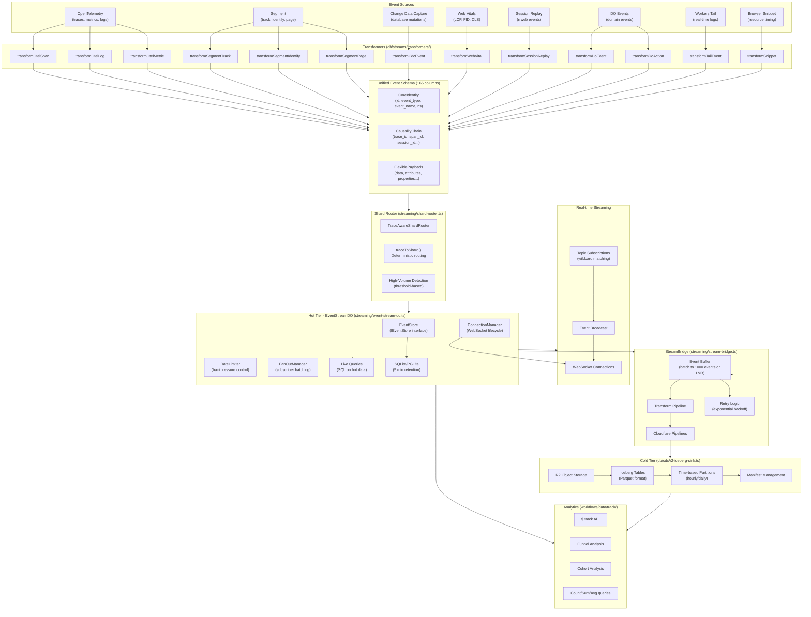

# Unified Events Architecture

This document describes the architecture of dotdo's unified events system, which provides a comprehensive observability and analytics pipeline for traces, metrics, logs, CDC events, and user analytics.

## Architecture Diagram



## Component Details

### Event Sources

| Source | Description | Event Types |
|--------|-------------|-------------|
| **OpenTelemetry** | Distributed tracing, metrics, and structured logs | `trace`, `metric`, `log` |
| **Segment** | User analytics events | `track`, `page`, `identify` |
| **CDC** | Database change capture from Things, Relationships, Events stores | `cdc` |
| **Web Vitals** | Core Web Vitals performance metrics (LCP, FID, CLS, TTFB, FCP, INP) | `vital` |
| **Session Replay** | rrweb-based DOM recording for session playback | `replay` |
| **DO Events** | Domain events from Durable Objects | `track` |
| **Workers Tail** | Real-time log streaming from Workers | `tail` |
| **Browser Snippet** | Resource timing from browser instrumentation | `snippet` |

### Transformers

Located in `db/streams/transformers/`, each transformer converts source-specific formats to the 165-column unified schema:

```typescript
// Example: OTEL Span transformation
const unified = transformOtelSpan(span, resource)
// Maps: traceId -> trace_id, spanId -> span_id, attributes -> data, etc.
```

Key transformers:
- `transformOtelSpan` - OpenTelemetry spans to trace events
- `transformOtelLog` - OTEL log records to log events
- `transformOtelMetric` - OTEL metrics (gauge, counter, histogram)
- `transformSegmentTrack` - Segment track calls to track events
- `transformCdcEvent` - Database changes to CDC events
- `transformWebVital` - Web Vitals metrics to vital events
- `transformSessionReplay` - rrweb events to replay events
- `transformDoEvent` / `transformDoAction` - DO domain events

### Shard Router

The `TraceAwareShardRouter` (`streaming/shard-router.ts`) provides horizontal scaling with 100% trace locality:

```typescript
const router = new TraceAwareShardRouter({
  shardCount: 16,
  highVolumeThreshold: 100_000,
})

// Write: all events for same trace go to same shard
const shardId = router.getShardId('tenant-123', event.trace_id)
// -> 'tenant-123-shard-7' (deterministic)

// Query with trace_id: efficient single-shard lookup
const shards = router.getQueryShards('tenant-123', 'trace-abc')
// -> ['tenant-123-shard-7']

// Query without trace_id: scatter-gather across all shards
const allShards = router.getQueryShards('tenant-123')
// -> ['tenant-123-shard-0', ..., 'tenant-123-shard-15']
```

### EventStreamDO (Hot Tier)

The `EventStreamDO` (`streaming/event-stream-do.ts`) is a Durable Object providing real-time event streaming:

**Key Features:**
- WebSocket connection handling with hibernation support
- Topic-based subscriptions with wildcard matching
- PGLite/SQLite for hot storage (5-minute retention)
- Live SQL queries on hot data
- Rate limiting and backpressure handling
- Fan-out batching for high subscriber counts

**Hot Tier Schema:**
```sql
CREATE TABLE events (
  id TEXT PRIMARY KEY,
  event_type TEXT NOT NULL,
  event_name TEXT NOT NULL,
  ns TEXT NOT NULL,
  trace_id TEXT,
  session_id TEXT,
  timestamp TEXT NOT NULL,
  outcome TEXT,
  http_status INTEGER,
  duration_ms REAL,
  data TEXT,
  -- ... additional columns
);

-- Correlation indexes
CREATE INDEX idx_trace ON events(trace_id);
CREATE INDEX idx_session ON events(session_id);
CREATE INDEX idx_type_time ON events(event_type, timestamp);
```

### StreamBridge (Pipeline)

The `StreamBridge` (`streaming/stream-bridge.ts`) batches events for Cloudflare Pipelines:

```typescript
const stream = new StreamBridge(env.EVENTS_PIPELINE, {
  batchSize: 1000,      // Events per batch
  batchBytes: 1048576,  // 1MB max
  flushInterval: 60000, // 60 seconds
  maxRetries: 3,
  exponentialBackoff: true,
})

// Send unified events
await stream.sendUnified(event)

// Or transform DO events on the fly
await stream.sendEvent(doEvent)
await stream.sendAction(doAction)
```

### R2 Iceberg Sink (Cold Tier)

The `R2IcebergSink` (`db/cdc/r2-iceberg-sink.ts`) archives events to R2 in Iceberg format:

**Features:**
- Parquet file output for data lake compatibility
- Time-based partitioning (hourly/daily/monthly)
- Iceberg manifest management
- Batch writes for efficiency

**Storage Layout:**
```
cdc/{namespace}/
  data/
    year=2024/month=01/day=15/hour=10/
      abc123-def456.parquet
  metadata/
    manifest-1.json
    manifest-2.json
    latest  -> manifest-2.json
```

### Analytics ($.track API)

The `createTrackContext()` (`workflows/data/track/context.ts`) provides the $.track analytics API:

```typescript
// Track events
await $.track.Signup({ userId: 'alice', plan: 'pro' })

// Query counts
const signups = await $.track.Signup.count().since('7d')

// Funnel analysis
const funnel = await $.track.funnel([
  $step('Signup'),
  $step('Activation'),
  $step('Purchase'),
]).within('7d')

// Cohort analysis
const cohorts = await $.track.cohort({
  anchor: 'Signup',
  activity: 'Purchase',
  periods: 12,
  granularity: 'week',
})
```

## Data Flow

1. **Ingestion**: Events arrive from various sources (OTEL, Segment, CDC, etc.)

2. **Transformation**: Source-specific transformers normalize events to the 165-column unified schema

3. **Routing**: TraceAwareShardRouter determines the target DO shard based on namespace and trace_id

4. **Hot Storage**: EventStreamDO stores events in SQLite/PGLite for 5-minute hot tier

5. **Real-time Streaming**: WebSocket subscribers receive events via topic-based pub/sub

6. **Cold Archival**: StreamBridge batches events and sends to Cloudflare Pipelines for R2/Iceberg storage

7. **Analytics**: $.track API provides funnel, cohort, and aggregation queries across both tiers

## Key Design Decisions

1. **Unified Schema**: A single 165-column schema supports all event types, enabling consistent querying across traces, metrics, logs, and analytics

2. **Trace Locality**: Events with the same trace_id are always routed to the same shard, enabling efficient trace reconstruction

3. **Two-Tier Storage**: Hot tier (SQLite/PGLite) for real-time queries, cold tier (R2/Iceberg) for long-term analytics

4. **Transformer Pattern**: Each source has a dedicated transformer, making it easy to add new event sources

5. **Backpressure Handling**: Rate limiting and fan-out batching prevent overwhelming subscribers or downstream systems
